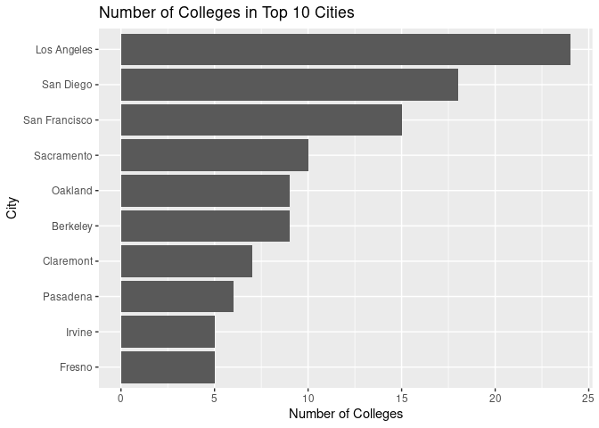
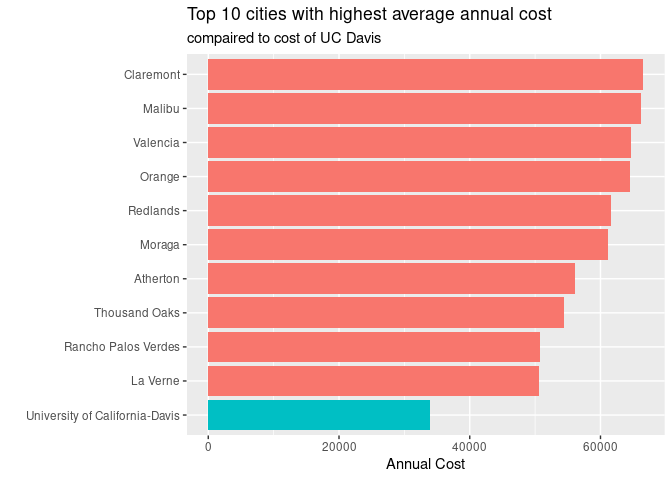
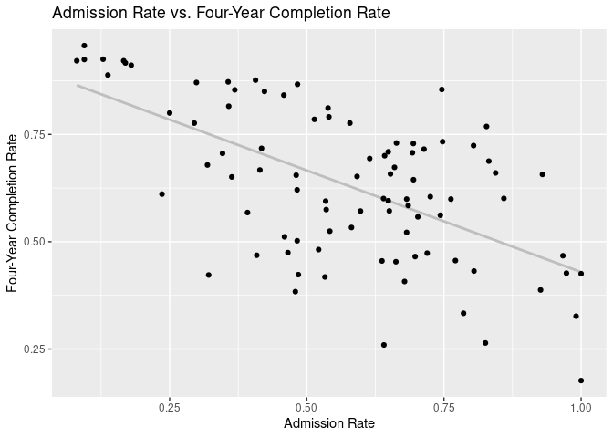
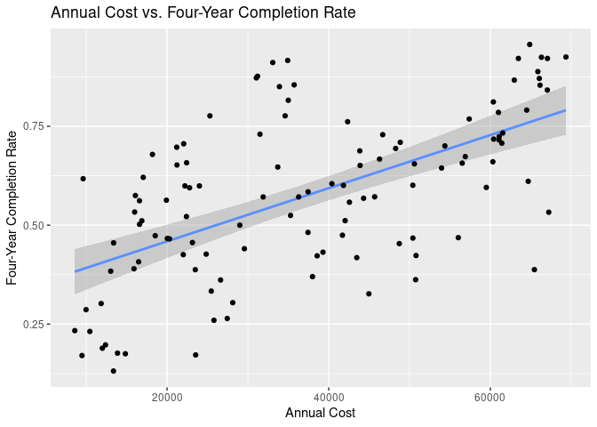
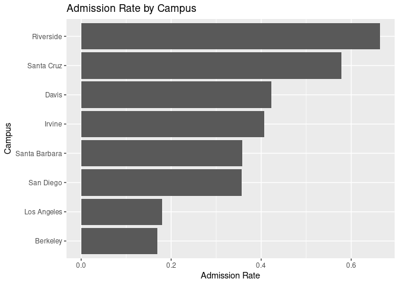
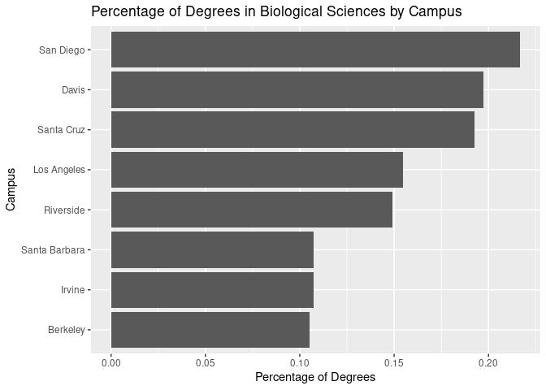

## Instructions
Answer the following questions and complete the exercises in RMarkdown. Please embed all of your code and push your final work to your repository. Your final lab report should be organized, clean, and run free from errors. Remember, you must remove the `#` for the included code chunks to run. Be sure to add your name to the author header above.  

Make sure to use the formatting conventions of RMarkdown to make your report neat and clean!  

## Load the libraries

```r
library(tidyverse)
library(janitor)
library(here)
library(naniar)
```

For this homework, we will take a departure from biological data and use data about California colleges. These data are a subset of the national college scorecard (https://collegescorecard.ed.gov/data/). Load the `ca_college_data.csv` as a new object called `colleges`.

```r
colleges <- read_csv("./data/ca_college_data.csv")
```

```
## Rows: 341 Columns: 10
## ── Column specification ────────────────────────────────────────────────────────
## Delimiter: ","
## chr (4): INSTNM, CITY, STABBR, ZIP
## dbl (6): ADM_RATE, SAT_AVG, PCIP26, COSTT4_A, C150_4_POOLED, PFTFTUG1_EF
## 
## ℹ Use `spec()` to retrieve the full column specification for this data.
## ℹ Specify the column types or set `show_col_types = FALSE` to quiet this message.
```

```r
head(colleges)
```

```
## # A tibble: 6 × 10
##   INSTNM       CITY  STABBR ZIP   ADM_R…¹ SAT_AVG PCIP26 COSTT…² C150_…³ PFTFT…⁴
##   <chr>        <chr> <chr>  <chr>   <dbl>   <dbl>  <dbl>   <dbl>   <dbl>   <dbl>
## 1 Grossmont C… El C… CA     9202…      NA      NA 0.0016    7956      NA   0.355
## 2 College of … Visa… CA     9327…      NA      NA 0.0066    8109      NA   0.541
## 3 College of … San … CA     9440…      NA      NA 0.0038    8278      NA   0.357
## 4 Ventura Col… Vent… CA     9300…      NA      NA 0.0035    8407      NA   0.382
## 5 Oxnard Coll… Oxna… CA     9303…      NA      NA 0.0085    8516      NA   0.275
## 6 Moorpark Co… Moor… CA     9302…      NA      NA 0.0151    8577      NA   0.429
## # … with abbreviated variable names ¹​ADM_RATE, ²​COSTT4_A, ³​C150_4_POOLED,
## #   ⁴​PFTFTUG1_EF
```

> The variables are a bit hard to decipher, here is a key:  
> 
> - INSTNM: Institution name  
> - CITY: California city  
> - STABBR: Location state  
> - ZIP: Zip code  
> - ADM_RATE: Admission rate  
> - SAT_AVG: SAT average score  
> - PCIP26: Percentage of degrees awarded in Biological And Biomedical Sciences  
> - COSTT4_A: Annual cost of attendance  
> - C150_4_POOLED: 4-year completion rate  
> - PFTFTUG1_EF: Percentage of undergraduate students who are first-time, full-time degree/certificate-seeking undergraduate students  

1. Use your preferred function(s) to have a look at the data and get an idea of its structure. Make sure you summarize NA's and determine whether or not the data are tidy. You may also consider dealing with any naming issues.


```r
glimpse(colleges)
```

```
## Rows: 341
## Columns: 10
## $ INSTNM        <chr> "Grossmont College", "College of the Sequoias", "College…
## $ CITY          <chr> "El Cajon", "Visalia", "San Mateo", "Ventura", "Oxnard",…
## $ STABBR        <chr> "CA", "CA", "CA", "CA", "CA", "CA", "CA", "CA", "CA", "C…
## $ ZIP           <chr> "92020-1799", "93277-2214", "94402-3784", "93003-3872", …
## $ ADM_RATE      <dbl> NA, NA, NA, NA, NA, NA, NA, NA, NA, NA, NA, NA, NA, NA, …
## $ SAT_AVG       <dbl> NA, NA, NA, NA, NA, NA, NA, NA, NA, NA, NA, NA, NA, NA, …
## $ PCIP26        <dbl> 0.0016, 0.0066, 0.0038, 0.0035, 0.0085, 0.0151, 0.0000, …
## $ COSTT4_A      <dbl> 7956, 8109, 8278, 8407, 8516, 8577, 8580, 9181, 9281, 93…
## $ C150_4_POOLED <dbl> NA, NA, NA, NA, NA, NA, 0.2334, NA, NA, NA, NA, 0.1704, …
## $ PFTFTUG1_EF   <dbl> 0.3546, 0.5413, 0.3567, 0.3824, 0.2753, 0.4286, 0.2307, …
```


```r
colleges <- colleges %>%
  rename(
    institution_name = INSTNM,
    city = CITY,
    state = STABBR,
    zip = ZIP,
    admission_rate = ADM_RATE,
    sat_average = SAT_AVG,
    pct_degrees_biological = PCIP26,
    annual_cost = COSTT4_A,
    four_year_completion_rate = C150_4_POOLED,
    pct_first_time_full_time = PFTFTUG1_EF
  )
head(colleges)
```

```
## # A tibble: 6 × 10
##   institutio…¹ city  state zip   admis…² sat_a…³ pct_d…⁴ annua…⁵ four_…⁶ pct_f…⁷
##   <chr>        <chr> <chr> <chr>   <dbl>   <dbl>   <dbl>   <dbl>   <dbl>   <dbl>
## 1 Grossmont C… El C… CA    9202…      NA      NA  0.0016    7956      NA   0.355
## 2 College of … Visa… CA    9327…      NA      NA  0.0066    8109      NA   0.541
## 3 College of … San … CA    9440…      NA      NA  0.0038    8278      NA   0.357
## 4 Ventura Col… Vent… CA    9300…      NA      NA  0.0035    8407      NA   0.382
## 5 Oxnard Coll… Oxna… CA    9303…      NA      NA  0.0085    8516      NA   0.275
## 6 Moorpark Co… Moor… CA    9302…      NA      NA  0.0151    8577      NA   0.429
## # … with abbreviated variable names ¹​institution_name, ²​admission_rate,
## #   ³​sat_average, ⁴​pct_degrees_biological, ⁵​annual_cost,
## #   ⁶​four_year_completion_rate, ⁷​pct_first_time_full_time
```


```r
naniar::miss_var_summary(colleges)
```

```
## # A tibble: 10 × 3
##    variable                  n_miss pct_miss
##    <chr>                      <int>    <dbl>
##  1 sat_average                  276     80.9
##  2 admission_rate               240     70.4
##  3 four_year_completion_rate    221     64.8
##  4 annual_cost                  124     36.4
##  5 pct_first_time_full_time      53     15.5
##  6 pct_degrees_biological        35     10.3
##  7 institution_name               0      0  
##  8 city                           0      0  
##  9 state                          0      0  
## 10 zip                            0      0
```

2. Which cities in California have the highest number of colleges?


```r
print(
college_count_by_city <- colleges %>%
  count(city) %>%
  arrange(desc(n)) %>%
  head(10)
)
```

```
## # A tibble: 10 × 2
##    city              n
##    <chr>         <int>
##  1 Los Angeles      24
##  2 San Diego        18
##  3 San Francisco    15
##  4 Sacramento       10
##  5 Berkeley          9
##  6 Oakland           9
##  7 Claremont         7
##  8 Pasadena          6
##  9 Fresno            5
## 10 Irvine            5
```

3. Based on your answer to #2, make a plot that shows the number of colleges in the top 10 cities.

```r
college_count_by_city %>%
  ggplot(mapping = aes(x = reorder(city, n), y = n)) +
  geom_col() +
  coord_flip() +
  labs(
    title = "Number of Colleges in Top 10 Cities",
    x = "City",
    y = "Number of Colleges"
  )
```

<!-- -->

4. The column `COSTT4_A` is the annual cost of each institution. Which city has the highest average cost? Where is it located?

```r
print(
college_top_avg_costs <- colleges %>%
  group_by(city) %>%
  summarise(
    avg_cost = mean(annual_cost, na.rm = TRUE)
  ) %>%
  arrange(desc(avg_cost)) %>%
  head(10)
)
```

```
## # A tibble: 10 × 2
##    city                avg_cost
##    <chr>                  <dbl>
##  1 Claremont              66498
##  2 Malibu                 66152
##  3 Valencia               64686
##  4 Orange                 64501
##  5 Redlands               61542
##  6 Moraga                 61095
##  7 Atherton               56035
##  8 Thousand Oaks          54373
##  9 Rancho Palos Verdes    50758
## 10 La Verne               50603
```

5. Based on your answer to #4, make a plot that compares the cost of the individual colleges in the most expensive city. Bonus! Add UC Davis here to see how it compares :>).

```r
college_top_avg_costs <- college_top_avg_costs %>%
  mutate(group = "city")

colleges %>%
  filter(institution_name == "University of California-Davis") %>%
  select(institution_name, annual_cost) %>%
  mutate(group = "ucd") %>%
  rename(
    city = institution_name,
    avg_cost = annual_cost
  ) %>%
  bind_rows(college_top_avg_costs) %>%
  ggplot(
    mapping = aes(x = reorder(city, avg_cost),
    y = avg_cost, 
    fill = group)
  ) +
  geom_col(show.legend = FALSE) +
  coord_flip() +
  labs(
    title = "Top 10 cities with highest average annual cost",
    subtitle = "compaired to cost of UC Davis",
    x = "",
    y = "Annual Cost"
  )
```

<!-- -->

6. The column `ADM_RATE` is the admissions rate by college and `C150_4_POOLED` is the four-year completion rate. Use a scatterplot to show the relationship between these two variables. What do you think this means?

```r
colleges %>%
  select(admission_rate, four_year_completion_rate) %>%
  drop_na() %>%
  ggplot(mapping = aes(x = admission_rate, y = four_year_completion_rate)) +
  geom_smooth(method = lm, se = FALSE, col = "grey") +
  geom_point() +
  labs(
    title = "Admission Rate vs. Four-Year Completion Rate",
    x = "Admission Rate",
    y = "Four-Year Completion Rate"
  )
```

```
## `geom_smooth()` using formula = 'y ~ x'
```

<!-- -->

7. Is there a relationship between cost and four-year completion rate? (You don't need to do the stats, just produce a plot). What do you think this means?

```r
colleges %>%
  select(annual_cost, four_year_completion_rate) %>%
  drop_na() %>%
  ggplot(mapping = aes(x = annual_cost, y = four_year_completion_rate)) +
  geom_smooth(method = lm, se = TRUE, col = "#5b8fff", level = .95) +
  geom_point() +
  labs(
    title = "Annual Cost vs. Four-Year Completion Rate",
    x = "Annual Cost",
    y = "Four-Year Completion Rate"
  )
```

```
## `geom_smooth()` using formula = 'y ~ x'
```

<!-- -->

8. The column titled `INSTNM` is the institution name. We are only interested in the University of California colleges. Make a new data frame that is restricted to UC institutions. You can remove `Hastings College of Law` and `UC San Francisco` as we are only interested in undergraduate institutions.

```r
UC <- colleges %>%
  filter(str_detect(institution_name, "University of California"))
```

Remove `Hastings College of Law` and `UC San Francisco` and store the final data frame as a new object `univ_calif_final`.

```r
univ_calif_final <- UC %>%
  filter(!grepl("Hastings College of Law", institution_name)) %>%
  filter(!grepl("San Francisco", institution_name))
rm(UC)
```

Use `separate()` to separate institution name into two new columns "UNIV" and "CAMPUS".

```r
univ_calif_final <- univ_calif_final %>%
  separate(
    institution_name,
    into = c("institution_name", "campus"),
  sep = "-"
  )
univ_calif_final
```

```
## # A tibble: 8 × 11
##   institution…¹ campus city  state zip   admis…² sat_a…³ pct_d…⁴ annua…⁵ four_…⁶
##   <chr>         <chr>  <chr> <chr> <chr>   <dbl>   <dbl>   <dbl>   <dbl>   <dbl>
## 1 University o… San D… La J… CA    92093   0.357    1324   0.216   31043   0.872
## 2 University o… Irvine Irvi… CA    92697   0.406    1206   0.107   31198   0.876
## 3 University o… River… Rive… CA    92521   0.663    1078   0.149   31494   0.73 
## 4 University o… Los A… Los … CA    9009…   0.180    1334   0.155   33078   0.911
## 5 University o… Davis  Davis CA    9561…   0.423    1218   0.198   33904   0.850
## 6 University o… Santa… Sant… CA    9506…   0.578    1201   0.193   34608   0.776
## 7 University o… Berke… Berk… CA    94720   0.169    1422   0.105   34924   0.916
## 8 University o… Santa… Sant… CA    93106   0.358    1281   0.108   34998   0.816
## # … with 1 more variable: pct_first_time_full_time <dbl>, and abbreviated
## #   variable names ¹​institution_name, ²​admission_rate, ³​sat_average,
## #   ⁴​pct_degrees_biological, ⁵​annual_cost, ⁶​four_year_completion_rate
```

9. The column `ADM_RATE` is the admissions rate by campus. Which UC has the lowest and highest admissions rates? Produce a numerical summary and an appropriate plot.

```r
print(
  tmp <- univ_calif_final %>%
    select(institution_name, campus, admission_rate) %>%
    arrange(-admission_rate)
)
```

```
## # A tibble: 8 × 3
##   institution_name         campus        admission_rate
##   <chr>                    <chr>                  <dbl>
## 1 University of California Riverside              0.663
## 2 University of California Santa Cruz             0.578
## 3 University of California Davis                  0.423
## 4 University of California Irvine                 0.406
## 5 University of California Santa Barbara          0.358
## 6 University of California San Diego              0.357
## 7 University of California Los Angeles            0.180
## 8 University of California Berkeley               0.169
```


```r
tmp %>%
  ggplot(
    mapping = aes(
      x = reorder(campus, admission_rate),
      y = admission_rate
    )
  ) +
  geom_col() +
  coord_flip() +
  labs(
    title = "Admission Rate by Campus",
    x = "Campus",
    y = "Admission Rate"
  )
```

<!-- -->

10. If you wanted to get a degree in biological or biomedical sciences, which campus confers the majority of these degrees? Produce a numerical summary and an appropriate plot.

```r
print(
  tmp <- univ_calif_final %>%
    select(institution_name, campus, pct_degrees_biological) %>%
    arrange(-pct_degrees_biological)
)
```

```
## # A tibble: 8 × 3
##   institution_name         campus        pct_degrees_biological
##   <chr>                    <chr>                          <dbl>
## 1 University of California San Diego                      0.216
## 2 University of California Davis                          0.198
## 3 University of California Santa Cruz                     0.193
## 4 University of California Los Angeles                    0.155
## 5 University of California Riverside                      0.149
## 6 University of California Santa Barbara                  0.108
## 7 University of California Irvine                         0.107
## 8 University of California Berkeley                       0.105
```


```r
tmp %>%
  ggplot(
    mapping = aes(
      x = reorder(campus, pct_degrees_biological),
      y = pct_degrees_biological
    )
  ) +
  geom_col() +
  coord_flip() +
  labs(
    title = "Percentage of Degrees in Biological Sciences by Campus",
    x = "Campus",
    y = "Percentage of Degrees"
  )
```

<!-- -->


## Knit Your Output and Post to [GitHub](https://github.com/FRS417-DataScienceBiologists)
