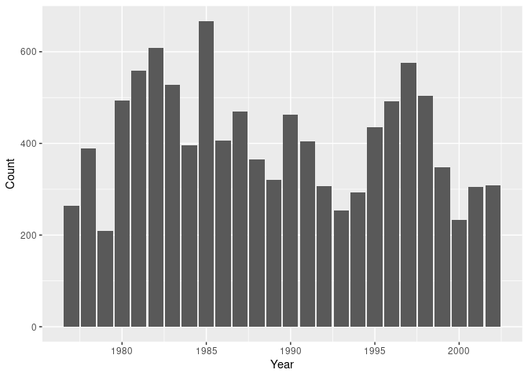

## Instructions
Answer the following questions and complete the exercises in RMarkdown. Please embed all of your code and push your final work to your repository. Your final lab report should be organized, clean, and run free from errors. Remember, you must remove the `#` for the included code chunks to run. Be sure to add your name to the author header above. For any included plots, make sure they are clearly labeled. You are free to use any plot type that you feel best communicates the results of your analysis.  

Make sure to use the formatting conventions of RMarkdown to make your report neat and clean!  

## Load the libraries

```r
library(tidyverse)
library(janitor)
library(here)
library(naniar)
```

## Desert Ecology
For this assignment, we are going to use a modified data set on [desert ecology](http://esapubs.org/archive/ecol/E090/118/). The data are from: S. K. Morgan Ernest, Thomas J. Valone, and James H. Brown. 2009. Long-term monitoring and experimental manipulation of a Chihuahuan Desert ecosystem near Portal, Arizona, USA. Ecology 90:1708.

```r
deserts <- read_csv(here("lab010", "data", "surveys_complete.csv"))
```

```
## Rows: 34786 Columns: 13
## ── Column specification ────────────────────────────────────────────────────────
## Delimiter: ","
## chr (6): species_id, sex, genus, species, taxa, plot_type
## dbl (7): record_id, month, day, year, plot_id, hindfoot_length, weight
## 
## ℹ Use `spec()` to retrieve the full column specification for this data.
## ℹ Specify the column types or set `show_col_types = FALSE` to quiet this message.
```

### 1. Use the function(s) of your choice to get an idea of its structure, including how NA's are treated. Are the data tidy?  


```r
head(deserts)
```

```
## # A tibble: 6 × 13
##   record_id month   day  year plot_id speci…¹ sex   hindf…² weight genus species
##       <dbl> <dbl> <dbl> <dbl>   <dbl> <chr>   <chr>   <dbl>  <dbl> <chr> <chr>  
## 1         1     7    16  1977       2 NL      M          32     NA Neot… albigu…
## 2         2     7    16  1977       3 NL      M          33     NA Neot… albigu…
## 3         3     7    16  1977       2 DM      F          37     NA Dipo… merria…
## 4         4     7    16  1977       7 DM      M          36     NA Dipo… merria…
## 5         5     7    16  1977       3 DM      M          35     NA Dipo… merria…
## 6         6     7    16  1977       1 PF      M          14     NA Pero… flavus 
## # … with 2 more variables: taxa <chr>, plot_type <chr>, and abbreviated
## #   variable names ¹​species_id, ²​hindfoot_length
```

```r
# the data is tidy, because each variable is in a column
# and each observation is in a row
```


```r
glimpse(deserts)
```

```
## Rows: 34,786
## Columns: 13
## $ record_id       <dbl> 1, 2, 3, 4, 5, 6, 7, 8, 9, 10, 11, 12, 13, 14, 15, 16,…
## $ month           <dbl> 7, 7, 7, 7, 7, 7, 7, 7, 7, 7, 7, 7, 7, 7, 7, 7, 7, 7, …
## $ day             <dbl> 16, 16, 16, 16, 16, 16, 16, 16, 16, 16, 16, 16, 16, 16…
## $ year            <dbl> 1977, 1977, 1977, 1977, 1977, 1977, 1977, 1977, 1977, …
## $ plot_id         <dbl> 2, 3, 2, 7, 3, 1, 2, 1, 1, 6, 5, 7, 3, 8, 6, 4, 3, 2, …
## $ species_id      <chr> "NL", "NL", "DM", "DM", "DM", "PF", "PE", "DM", "DM", …
## $ sex             <chr> "M", "M", "F", "M", "M", "M", "F", "M", "F", "F", "F",…
## $ hindfoot_length <dbl> 32, 33, 37, 36, 35, 14, NA, 37, 34, 20, 53, 38, 35, NA…
## $ weight          <dbl> NA, NA, NA, NA, NA, NA, NA, NA, NA, NA, NA, NA, NA, NA…
## $ genus           <chr> "Neotoma", "Neotoma", "Dipodomys", "Dipodomys", "Dipod…
## $ species         <chr> "albigula", "albigula", "merriami", "merriami", "merri…
## $ taxa            <chr> "Rodent", "Rodent", "Rodent", "Rodent", "Rodent", "Rod…
## $ plot_type       <chr> "Control", "Long-term Krat Exclosure", "Control", "Rod…
```


```r
naniar::miss_var_summary(deserts)
```

```
## # A tibble: 13 × 3
##    variable        n_miss pct_miss
##    <chr>            <int>    <dbl>
##  1 hindfoot_length   3348     9.62
##  2 weight            2503     7.20
##  3 sex               1748     5.03
##  4 record_id            0     0   
##  5 month                0     0   
##  6 day                  0     0   
##  7 year                 0     0   
##  8 plot_id              0     0   
##  9 species_id           0     0   
## 10 genus                0     0   
## 11 species              0     0   
## 12 taxa                 0     0   
## 13 plot_type            0     0
```

### 2. How many genera and species are represented in the data? What are the total number of observations? Which species is most/ least frequently sampled in the study?


```r
deserts %>%
  count(genus, species) %>%
  slice_min(n, n = 1)
```

```
## # A tibble: 6 × 3
##   genus         species          n
##   <chr>         <chr>        <int>
## 1 Cnemidophorus tigris           1
## 2 Cnemidophorus uniparens        1
## 3 Crotalus      scutalatus       1
## 4 Crotalus      viridis          1
## 5 Sceloporus    clarki           1
## 6 Spermophilus  tereticaudus     1
```


```r
deserts %>%
  count(genus, species) %>%
  slice_max(n, n = 1)
```

```
## # A tibble: 1 × 3
##   genus     species      n
##   <chr>     <chr>    <int>
## 1 Dipodomys merriami 10596
```

### 3. What is the proportion of taxa included in this study? Show a table and plot that reflects this count.


```r
print(
  tmp <- deserts %>%
    count(taxa) %>%
    mutate(prop = n / sum(n))
)
```

```
## # A tibble: 4 × 3
##   taxa        n     prop
##   <chr>   <int>    <dbl>
## 1 Bird      450 0.0129  
## 2 Rabbit     75 0.00216 
## 3 Reptile    14 0.000402
## 4 Rodent  34247 0.985
```


```r
ggplot(tmp, aes(x = taxa, y = prop)) +
  geom_col() +
  scale_y_continuous(labels = scales::percent) +
  labs(x = "Taxa", y = "Count") +
  theme(
    axis.text.x = element_text(angle = 45, hjust = 1)
  )
```

<!-- -->

### 4. For the taxa included in the study, use the fill option to show the proportion of individuals sampled by `plot_type.`


```r
tmp <- deserts %>%
  count(taxa, plot_type) %>%
  group_by(taxa) %>%
  mutate(prop = n / sum(n))
tmp
```

```
## # A tibble: 19 × 4
## # Groups:   taxa [4]
##    taxa    plot_type                     n   prop
##    <chr>   <chr>                     <int>  <dbl>
##  1 Bird    Control                     110 0.244 
##  2 Bird    Long-term Krat Exclosure     67 0.149 
##  3 Bird    Rodent Exclosure            118 0.262 
##  4 Bird    Short-term Krat Exclosure   131 0.291 
##  5 Bird    Spectab exclosure            24 0.0533
##  6 Rabbit  Control                      29 0.387 
##  7 Rabbit  Long-term Krat Exclosure     17 0.227 
##  8 Rabbit  Rodent Exclosure             24 0.32  
##  9 Rabbit  Short-term Krat Exclosure     2 0.0267
## 10 Rabbit  Spectab exclosure             3 0.04  
## 11 Reptile Control                       6 0.429 
## 12 Reptile Long-term Krat Exclosure      3 0.214 
## 13 Reptile Rodent Exclosure              1 0.0714
## 14 Reptile Short-term Krat Exclosure     4 0.286 
## 15 Rodent  Control                   15466 0.452 
## 16 Rodent  Long-term Krat Exclosure   5031 0.147 
## 17 Rodent  Rodent Exclosure           4090 0.119 
## 18 Rodent  Short-term Krat Exclosure  5769 0.168 
## 19 Rodent  Spectab exclosure          3891 0.114
```


```r
ggplot(tmp, aes(x = taxa, y = prop, fill = plot_type)) +
  geom_col() +
  scale_y_continuous(labels = scales::percent) +
  labs(x = "Taxa", y = "Count") +
  theme(
    axis.text.x = element_text(angle = 45, hjust = 1)
  )
```

<!-- -->

### 5. What is the range of weight for each species included in the study? Remove any observations of weight that are NA so they do not show up in the plot.


```r
deserts %>%
  drop_na(weight) %>%
  ggplot(aes(x = species, y = weight)) +
  geom_boxplot() +
  scale_y_log10() +
  theme(
    axis.text.x = element_text(angle = 45, hjust = 1)
  )
```

<!-- -->

### 6. Add another layer to your answer from #5 using `geom_point` to get an idea of how many measurements were taken for each species.


```r
deserts %>%
  drop_na(weight) %>%
  ggplot(aes(x = species, y = weight)) +
  geom_jitter(color = "pink", alpha = 0.2) +
  geom_boxplot(alpha = 0.35) +
  scale_y_log10() +
  theme(
    axis.text.x = element_text(angle = 45, hjust = 1)
  )
```

<!-- -->

### 7. [Dipodomys merriami](https://en.wikipedia.org/wiki/Merriam's_kangaroo_rat) is the most frequently sampled animal in the study. How have the number of observations of this species changed over the years included in the study?


```r
deserts %>%
  filter(species == "merriami") %>%
  count(year) %>%
  ggplot(aes(x = year, y = n)) +
  geom_col() +
  labs(x = "Year", y = "Count")
```

<!-- -->

### 8. What is the relationship between `weight` and `hindfoot` length? Consider whether or not over plotting is an issue.


```r
deserts %>%
  drop_na(weight, hindfoot_length) %>%
  ggplot(aes(x = hindfoot_length, y = weight)) +
  geom_point(alpha = 0.35) +
  scale_y_log10()
```

<!-- -->

### 9. Which two species have, on average, the highest weight? Once you have identified them, make a new column that is a ratio of `weight` to `hindfoot_length`. Make a plot that shows the range of this new ratio and fill by sex.


```r
tmp <- deserts %>%
  drop_na(weight, hindfoot_length) %>%
  group_by(species) %>%
  summarize(mean_weight = mean(weight)) %>%
  slice_max(mean_weight, n = 2)
tmp
```

```
## # A tibble: 2 × 2
##   species     mean_weight
##   <chr>             <dbl>
## 1 albigula           159.
## 2 spectabilis        120.
```

```r
tmp$species
```

```
## [1] "albigula"    "spectabilis"
```

```r
tmp <- deserts %>%
  select(species, weight, hindfoot_length, sex) %>%
  filter(species %in% tmp$species) %>%
  drop_na(weight, hindfoot_length, sex) %>%
  mutate(ratio = weight / hindfoot_length)
tmp
```

```
## # A tibble: 3,068 × 5
##    species     weight hindfoot_length sex   ratio
##    <chr>        <dbl>           <dbl> <chr> <dbl>
##  1 spectabilis    117              50 F      2.34
##  2 spectabilis    121              51 F      2.37
##  3 spectabilis    115              51 M      2.25
##  4 spectabilis    120              48 F      2.5 
##  5 spectabilis    118              48 F      2.46
##  6 spectabilis    126              52 F      2.42
##  7 spectabilis    132              50 M      2.64
##  8 spectabilis    122              53 F      2.30
##  9 spectabilis    107              48 F      2.23
## 10 spectabilis    115              50 F      2.3 
## # … with 3,058 more rows
```


```r
ggplot(tmp, aes(x = species, y = ratio, fill = sex)) +
  geom_boxplot(alpha = 0.35) +
  scale_y_log10() +
  labs(x = "Species", y = "Ratio") +
  theme(
    axis.text.x = element_text(angle = 45, hjust = 1)
  )
```

<!-- -->

### 10. Make one plot of your choice! Make sure to include at least two of the aesthetics options you have learned.


```r
# Number of taxa each year.
deserts %>%
  select(year, taxa) %>%
  drop_na(year, taxa) %>%
  group_by(year) %>%
  count(taxa) %>%
  ggplot(aes(x = year, y = n, fill = taxa)) +
  geom_col() +
  scale_y_log10() +
  labs(x = "Year", y = "Count") +
  theme(
    axis.text.x = element_text(angle = 45, hjust = 1)
  )
```

<!-- -->

## Push your final code to GitHub!
Please be sure that you check the `keep md` file in the knit preferences. 
