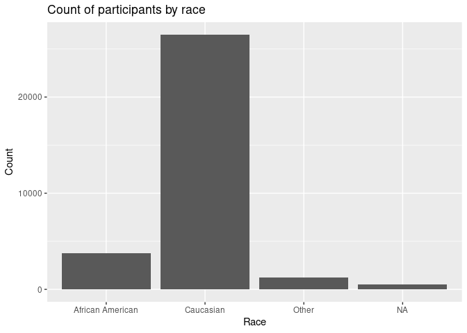
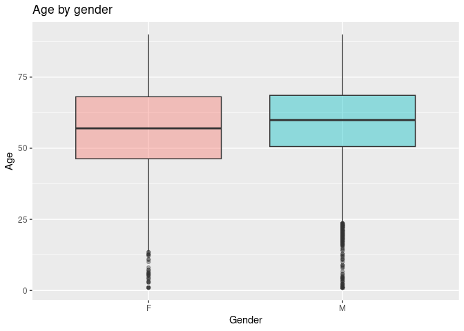
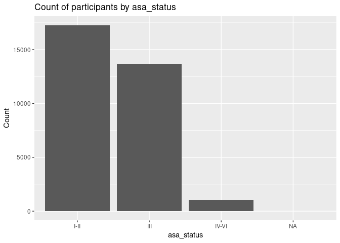
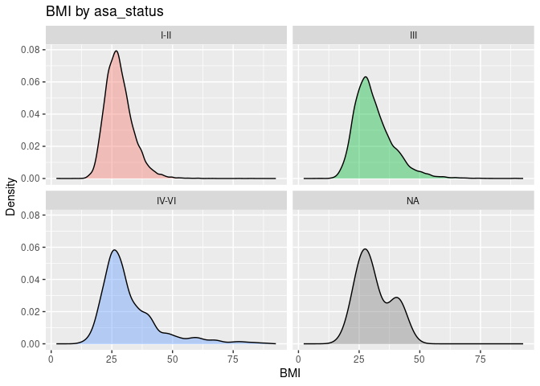
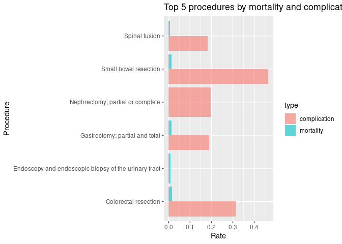
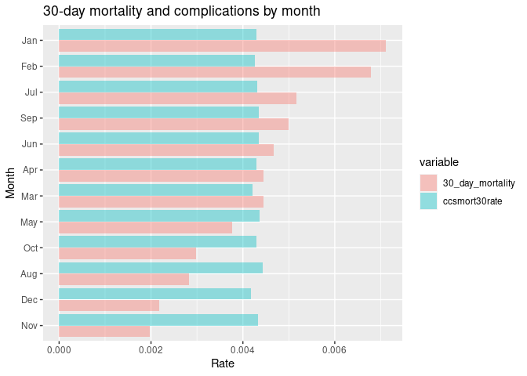

## Instructions
Answer the following questions and complete the exercises in RMarkdown. Please embed all of your code and push your final work to your repository. Your code should be organized, clean, and run free from errors. Remember, you must remove the `#` for any included code chunks to run. Be sure to add your name to the author header above.  

After the first 50 minutes, please upload your code (5 points). During the second 50 minutes, you may get help from each other- but no copy/paste. Upload the last version at the end of this time, but be sure to indicate it as final. If you finish early, you are free to leave.

Make sure to use the formatting conventions of RMarkdown to make your report neat and clean! Use the tidyverse and pipes unless otherwise indicated. To receive full credit, all plots must have clearly labeled axes, a title, and consistent aesthetics. This exam is worth a total of 35 points. 

Please load the following libraries.

```r
library("tidyverse")
library("janitor")
library("naniar")
```

## Data
These data are from a study on surgical residents. The study was originally published by Sessier et al. “Operation Timing and 30-Day Mortality After Elective General Surgery”. Anesth Analg 2011; 113: 1423-8. The data were cleaned for instructional use by Amy S. Nowacki, “Surgery Timing Dataset”, TSHS Resources Portal (2016). Available at https://www.causeweb.org/tshs/surgery-timing/.

Descriptions of the variables and the study are included as pdf's in the data folder.  

Please run the following chunk to import the data.

```r
surgery <- read_csv("data/surgery.csv")
```

1. (2 points) Use the summary function(s) of your choice to explore the data and get an idea of its structure. Please also check for NA's.


```r
glimpse(surgery)
```

```
## Rows: 32,001
## Columns: 25
## $ ahrq_ccs            <chr> "<Other>", "<Other>", "<Other>", "<Other>", "<Othe…
## $ age                 <dbl> 67.8, 39.5, 56.5, 71.0, 56.3, 57.7, 56.6, 64.2, 66…
## $ gender              <chr> "M", "F", "F", "M", "M", "F", "M", "F", "M", "F", …
## $ race                <chr> "Caucasian", "Caucasian", "Caucasian", "Caucasian"…
## $ asa_status          <chr> "I-II", "I-II", "I-II", "III", "I-II", "I-II", "IV…
## $ bmi                 <dbl> 28.04, 37.85, 19.56, 32.22, 24.32, 40.30, 64.57, 4…
## $ baseline_cancer     <chr> "No", "No", "No", "No", "Yes", "No", "No", "No", "…
## $ baseline_cvd        <chr> "Yes", "Yes", "No", "Yes", "No", "Yes", "Yes", "Ye…
## $ baseline_dementia   <chr> "No", "No", "No", "No", "No", "No", "No", "No", "N…
## $ baseline_diabetes   <chr> "No", "No", "No", "No", "No", "No", "Yes", "No", "…
## $ baseline_digestive  <chr> "Yes", "No", "No", "No", "No", "No", "No", "No", "…
## $ baseline_osteoart   <chr> "No", "No", "No", "No", "No", "No", "No", "No", "N…
## $ baseline_psych      <chr> "No", "No", "No", "No", "No", "Yes", "No", "No", "…
## $ baseline_pulmonary  <chr> "No", "No", "No", "No", "No", "No", "No", "No", "N…
## $ baseline_charlson   <dbl> 0, 0, 0, 0, 0, 0, 2, 0, 1, 2, 0, 1, 0, 0, 0, 0, 0,…
## $ mortality_rsi       <dbl> -0.63, -0.63, -0.49, -1.38, 0.00, -0.77, -0.36, -0…
## $ complication_rsi    <dbl> -0.26, -0.26, 0.00, -1.15, 0.00, -0.84, -1.34, 0.0…
## $ ccsmort30rate       <dbl> 0.0042508, 0.0042508, 0.0042508, 0.0042508, 0.0042…
## $ ccscomplicationrate <dbl> 0.07226355, 0.07226355, 0.07226355, 0.07226355, 0.…
## $ hour                <dbl> 9.03, 18.48, 7.88, 8.80, 12.20, 7.67, 9.53, 7.52, …
## $ dow                 <chr> "Mon", "Wed", "Fri", "Wed", "Thu", "Thu", "Tue", "…
## $ month               <chr> "Nov", "Sep", "Aug", "Jun", "Aug", "Dec", "Apr", "…
## $ moonphase           <chr> "Full Moon", "New Moon", "Full Moon", "Last Quarte…
## $ mort30              <chr> "No", "No", "No", "No", "No", "No", "No", "No", "N…
## $ complication        <chr> "No", "No", "No", "No", "No", "No", "No", "Yes", "…
```


```r
head(surgery)
```

```
## # A tibble: 6 × 25
##   ahrq_ccs   age gender race       asa_s…¹   bmi basel…² basel…³ basel…⁴ basel…⁵
##   <chr>    <dbl> <chr>  <chr>      <chr>   <dbl> <chr>   <chr>   <chr>   <chr>  
## 1 <Other>   67.8 M      Caucasian  I-II     28.0 No      Yes     No      No     
## 2 <Other>   39.5 F      Caucasian  I-II     37.8 No      Yes     No      No     
## 3 <Other>   56.5 F      Caucasian  I-II     19.6 No      No      No      No     
## 4 <Other>   71   M      Caucasian  III      32.2 No      Yes     No      No     
## 5 <Other>   56.3 M      African A… I-II     24.3 Yes     No      No      No     
## 6 <Other>   57.7 F      Caucasian  I-II     40.3 No      Yes     No      No     
## # … with 15 more variables: baseline_digestive <chr>, baseline_osteoart <chr>,
## #   baseline_psych <chr>, baseline_pulmonary <chr>, baseline_charlson <dbl>,
## #   mortality_rsi <dbl>, complication_rsi <dbl>, ccsmort30rate <dbl>,
## #   ccscomplicationrate <dbl>, hour <dbl>, dow <chr>, month <chr>,
## #   moonphase <chr>, mort30 <chr>, complication <chr>, and abbreviated variable
## #   names ¹​asa_status, ²​baseline_cancer, ³​baseline_cvd, ⁴​baseline_dementia,
## #   ⁵​baseline_diabetes
```


```r
naniar::miss_var_summary(surgery)
```

```
## # A tibble: 25 × 3
##    variable          n_miss pct_miss
##    <chr>              <int>    <dbl>
##  1 bmi                 3290 10.3    
##  2 race                 480  1.50   
##  3 asa_status             8  0.0250 
##  4 gender                 3  0.00937
##  5 age                    2  0.00625
##  6 ahrq_ccs               0  0      
##  7 baseline_cancer        0  0      
##  8 baseline_cvd           0  0      
##  9 baseline_dementia      0  0      
## 10 baseline_diabetes      0  0      
## # … with 15 more rows
```


2. (3 points) Let's explore the participants in the study. Show a count of participants by race AND make a plot that visually represents your output.


```r
dat <- surgery %>%
  count(race)
dat
```

```
## # A tibble: 4 × 2
##   race                 n
##   <chr>            <int>
## 1 African American  3790
## 2 Caucasian        26488
## 3 Other             1243
## 4 <NA>               480
```

```r
dat %>%
  ggplot(aes(x = race, y = n)) +
  geom_col() +
  labs(
    title = "Count of participants by race",
    x = "Race",
    y = "Count"
  )
```

<!-- -->

3. (2 points) What is the mean age of participants by gender? (hint: please provide a number for each) Since only three participants do not have gender indicated, remove these participants from the data.


```r
dat <- surgery %>%
  filter(!is.na(gender)) %>%
  group_by(gender) %>%
  summarise(mean_age = mean(age, na.rm = TRUE))
dat
```

```
## # A tibble: 2 × 2
##   gender mean_age
##   <chr>     <dbl>
## 1 F          56.7
## 2 M          58.8
```


4. (3 points) Make a plot that shows the range of age associated with gender.


```r
surgery %>%
  filter(!is.na(age) & !is.na(gender)) %>%
  ggplot(aes(x = gender, y = age, fill = gender)) +
  geom_boxplot(alpha = 0.4) +
  labs(
    title = "Age by gender",
    x = "Gender",
    y = "Age"
  ) +
  theme(legend.position = "none")
```

<!-- -->

5. (2 points) How healthy are the participants? The variable `asa_status` is an evaluation of patient physical status prior to surgery. Lower numbers indicate fewer comorbidities (presence of two or more diseases or medical conditions in a patient). Make a plot that compares the number of `asa_status` I-II, III, and IV-V.


```r
dat <- surgery %>%
  count(asa_status)
dat
```

```
## # A tibble: 4 × 2
##   asa_status     n
##   <chr>      <int>
## 1 I-II       17261
## 2 III        13677
## 3 IV-VI       1055
## 4 <NA>           8
```

```r
dat %>%
  ggplot(aes(x = asa_status, y = n)) +
  geom_col() +
  labs(
    title = "Count of participants by asa_status",
    x = "asa_status",
    y = "Count"
  )
```

<!-- -->

6. (3 points) Create a plot that displays the distribution of body mass index for each `asa_status` as a probability distribution- not a histogram. (hint: use faceting!)


```r
surgery %>%
  filter(!is.na(bmi)) %>%
  ggplot(aes(x = bmi, fill = asa_status)) +
  geom_density(alpha = 0.4) +
  labs(
    title = "BMI by asa_status",
    x = "BMI",
    y = "Density"
  ) +
  facet_wrap(~asa_status) +
  theme(legend.position = "none")
```

<!-- -->

The variable `ccsmort30rate` is a measure of the overall 30-day mortality rate associated with each type of operation. The variable `ccscomplicationrate` is a measure of the 30-day in-hospital complication rate. The variable `ahrq_ccs` lists each type of operation.  

7. (4 points) What are the 5 procedures associated with highest risk of 30-day mortality AND how do they compare with the 5 procedures with highest risk of complication? (hint: no need for a plot here)


```r
dat <- surgery %>%
  group_by(ahrq_ccs) %>%
  summarise(
    ccsmort30rate = mean(ccsmort30rate, na.rm = TRUE),
    ccscomplicationrate = mean(ccscomplicationrate, na.rm = TRUE)
  )

## 5 procedures with highest risk of 30-day mortality
dat %>%
  slice_max(ccsmort30rate, n = 5)
```

```
## # A tibble: 5 × 3
##   ahrq_ccs                                             ccsmort30rate ccscompli…¹
##   <chr>                                                        <dbl>       <dbl>
## 1 Colorectal resection                                       0.0167       0.312 
## 2 Small bowel resection                                      0.0129       0.466 
## 3 Gastrectomy; partial and total                             0.0127       0.190 
## 4 Endoscopy and endoscopic biopsy of the urinary tract       0.00811      0.0270
## 5 Spinal fusion                                              0.00742      0.183 
## # … with abbreviated variable name ¹​ccscomplicationrate
```

```r
## 5 procedures with highest risk of complication
dat %>%
  slice_max(ccscomplicationrate, n = 5)
```

```
## # A tibble: 5 × 3
##   ahrq_ccs                         ccsmort30rate ccscomplicationrate
##   <chr>                                    <dbl>               <dbl>
## 1 Small bowel resection                  0.0129                0.466
## 2 Colorectal resection                   0.0167                0.312
## 3 Nephrectomy; partial or complete       0.00276               0.197
## 4 Gastrectomy; partial and total         0.0127                0.190
## 5 Spinal fusion                          0.00742               0.183
```

8. (3 points) Make a plot that compares the `ccsmort30rate` for all listed `ahrq_ccs` procedures.


```r
# used the mean and barplot because ccsmort30rate for same ahrq_ccs was the same
surgery %>%
  group_by(ahrq_ccs) %>%
  summarise(
    ccsmort30rate = mean(ccsmort30rate, na.rm = TRUE)
  ) %>%
  ggplot(
    aes(
      x = reorder(ahrq_ccs, ccsmort30rate),
      y = ccsmort30rate
    )
  ) +
  geom_col(alpha = 0.4) +
  labs(
    title = "30-day mortality rate by procedure",
    x = "Procedure",
    y = "30-day mortality rate"
  ) +
  theme(
    legend.position = "none"
  ) +
  coord_flip()
```

<!-- -->

9.  (4 points) When is the best month to have surgery? Make a chart that shows the 30-day mortality and complications for the patients by month. `mort30` is the variable that shows whether or not a patient survived 30 days post-operation.


```r
dat <- surgery %>%
  mutate(mort30 = ifelse(mort30 == "Yes", TRUE, FALSE)) %>%
  mutate(mort30 = as.logical(mort30)) %>%
  mutate(month = factor(month, levels = c("Jan", "Feb", "Mar", "Apr", "May", "Jun", "Jul", "Aug", "Sep", "Oct", "Nov", "Dec"))) %>%
  group_by(month) %>%
  summarise(
    ccsmort30rate = mean(ccsmort30rate, na.rm = TRUE),
    ccscomplicationrate = mean(ccscomplicationrate, na.rm = TRUE),
    `30_day_mortality` = sum(mort30) / n()
  ) %>%
  arrange(month)
dat
```

```
## # A tibble: 12 × 4
##    month ccsmort30rate ccscomplicationrate `30_day_mortality`
##    <fct>         <dbl>               <dbl>              <dbl>
##  1 Jan         0.00429               0.134            0.00712
##  2 Feb         0.00427               0.134            0.00678
##  3 Mar         0.00421               0.131            0.00445
##  4 Apr         0.00430               0.131            0.00445
##  5 May         0.00436               0.132            0.00377
##  6 Jun         0.00435               0.132            0.00468
##  7 Jul         0.00432               0.134            0.00516
##  8 Aug         0.00443               0.136            0.00283
##  9 Sep         0.00435               0.135            0.00499
## 10 Oct         0.00430               0.133            0.00298
## 11 Nov         0.00433               0.134            0.00197
## 12 Dec         0.00418               0.133            0.00218
```


```r
dat %>%
  select(-ccscomplicationrate) %>%
  pivot_longer(
    cols = c(ccsmort30rate, `30_day_mortality`),
    names_to = "variable",
    values_to = "value"
  ) %>%
  ggplot(
    aes(
      x = reorder(month, value),
      y = value,
      fill = variable
    )
  ) +
  geom_col(alpha = 0.4, position = "dodge") +
  labs(
    title = "30-day mortality and complications by month",
    x = "Month",
    y = "Rate"
  ) +
  coord_flip()
```

<!-- -->


10. (4 points) Make a plot that visualizes the chart from question #9. Make sure that the months are on the x-axis. Do a search online and figure out how to order the months Jan-Dec.

Please provide the names of the students you have worked with with during the exam:

Please be 100% sure your exam is saved, knitted, and pushed to your github repository. No need to submit a link on canvas, we will find your exam in your repository.
